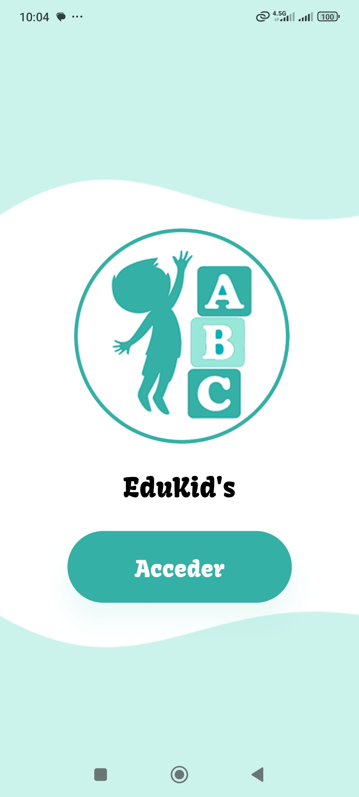
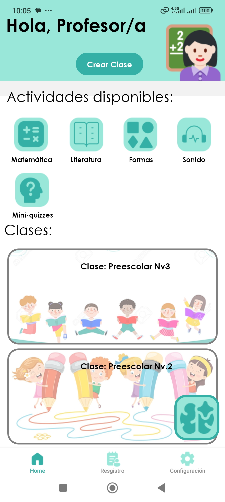
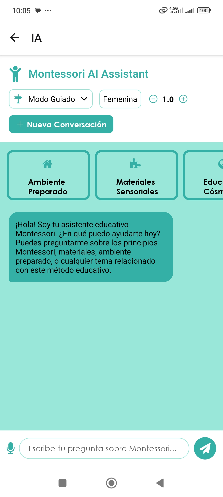
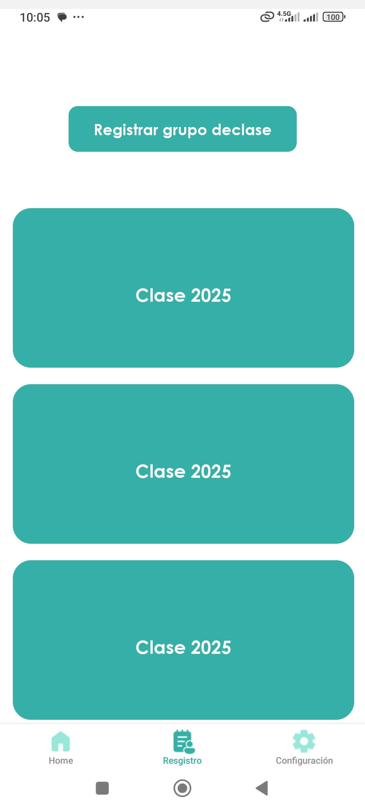
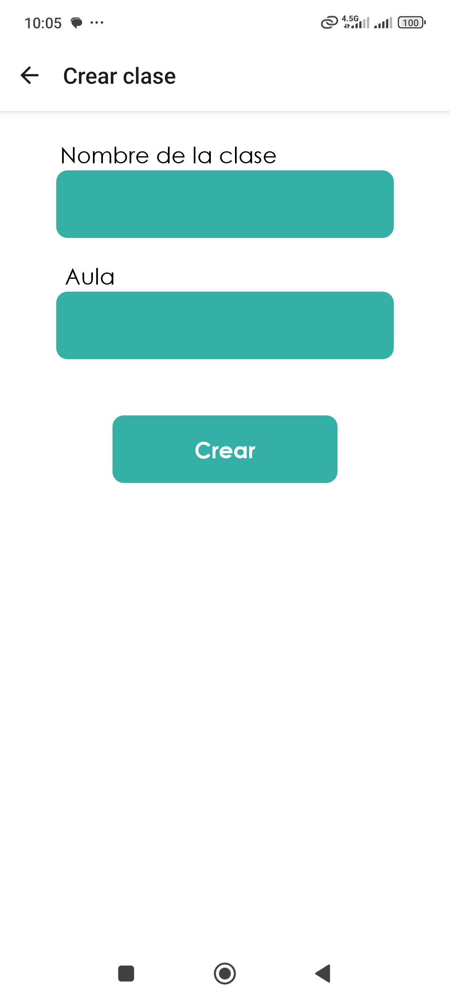
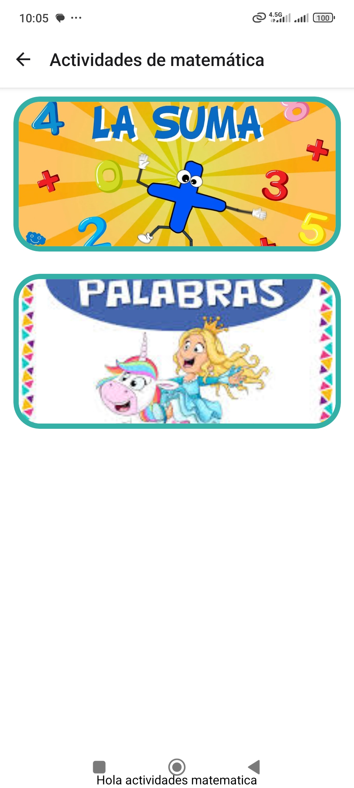

# EduKid's

**EduKid's** es una aplicación educativa móvil inspirada en el método Montessori, diseñada para fomentar el aprendizaje autónomo, sensorial y progresivo en niños de edad preescolar. La app combina principios pedagógicos con tecnología moderna para ofrecer una experiencia interactiva, segura y visualmente atractiva.

## Capturas de pantalla

## Características

Gestión docente
- Registro de estudiantes mediante código único proporcionado por la institución.
- Creación de clases con código identificador para vincular estudiAsignación de actividades por área educativa: Literatura, Matemáticas, Formas y Sonidos.Fullscreen mode
- Visualización de estadísticas de avance por estudiante y por actividad.
- Control centralizado del progreso académico desde el panel docente.
- **Guía interactiva Montessori (IA):** Herramienta digital que apoya al docente en la comprensión y aplicación del método Montessori.

**Experiencia del estudiante**
- Ingreso seguro con código único de estudiante (sin necesidad de contraseña).
- Unirse a clases mediante código de clase proporcionado por el docente.
- Interacción directa con actividades asignadas por el docente.
- Visualización de progreso personal dentro de cada área educativa.

**Áreas educativas disponibles**
- **Literatura:** comprensión lectora, asociación de palabras e imágenes.
- **Matemáticas:** conteo, operaciones básicas, lógica numérica.
- **Formas:** reconocimiento y clasificación de figuras geométricas.
- **Sonidos:** identificación auditiva, relación sonido-imagen.
## Tecnología

**Frontend:** react native.

**DB:** Firebase.

## Referencia de API
#### Magic Loops API
#### Obtener artículo

  GET /api/items/${id}

| Parámetro | Tipo     | Descripción                       |
| :-------- | :------- | :-------------------------------- |
| `id`      | `string` | **Requerido**. Id del artículo a buscar|

#### Correr Magic Loop

  POST /api/loop/${loop_id}/run

| Parámetro     | Tipo     | Descripción                                                                 |
| :------------ | :------- | :-------------------------------------------------------------------------- |
| `loop_id`     | `string` | **Requerido**. ID del Loop que querés ejecutar                               |
| `api_key`     | `string` | **Requerido**. Tu clave de autenticación para Magic Loops                    |
| `input_data`  | `object` | **Opcional**. Datos de entrada que el Loop necesita para generar contenido  |

#### Firestore REST APIs: Create Document

| Parámetro       | Tipo     | Descripción                                 |
| :-------------- | :------- | :------------------------------------------ |
| `project_id`    | `string` | **Requerido**. ID del proyecto Firebase      |
| `collection`    | `string` | **Requerido**. Nombre de la colección        |
| `access_token`  | `string` | **Requerido**. Token OAuth2 para autenticación |
| `fields`        | `object` | **Requerido**. Datos del documento en formato Firestore |

## React Native API Referencia

| API                  | Descripción breve                                      |
|----------------------|--------------------------------------------------------|
| `Alert`              | Muestra diálogos nativos de alerta                     |
| `Animated`           | Maneja animaciones fluidas y declarativas              |
| `Dimensions`         | Obtiene tamaño de pantalla y orientación               |
| `Linking`            | Abre URLs externas o maneja enlaces internos           |
| `PermissionsAndroid` | Solicita permisos en Android                           |
| `BackHandler`        | Detecta botón físico de "volver" en Android            |
| `KeyboardAvoidingView` | Ajusta la vista cuando aparece el teclado            |
| `Share`              | Abre el menú nativo para compartir contenido           |
| `Vibration`          | Controla la vibración del dispositivo                  |
